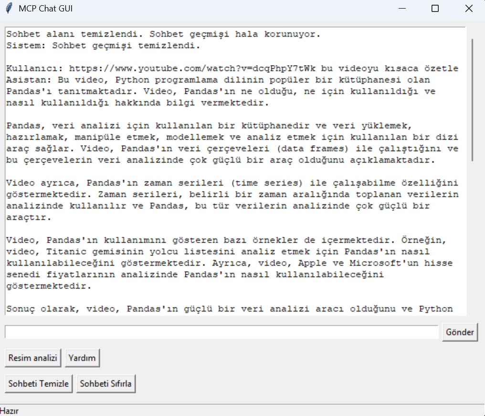
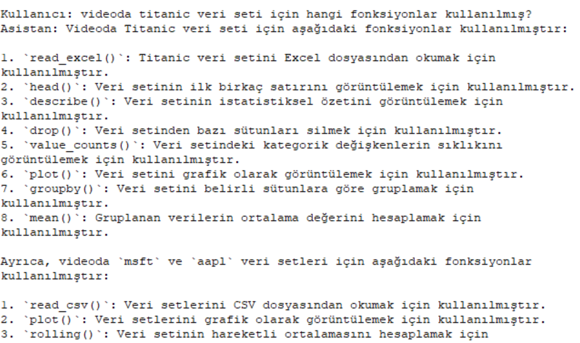
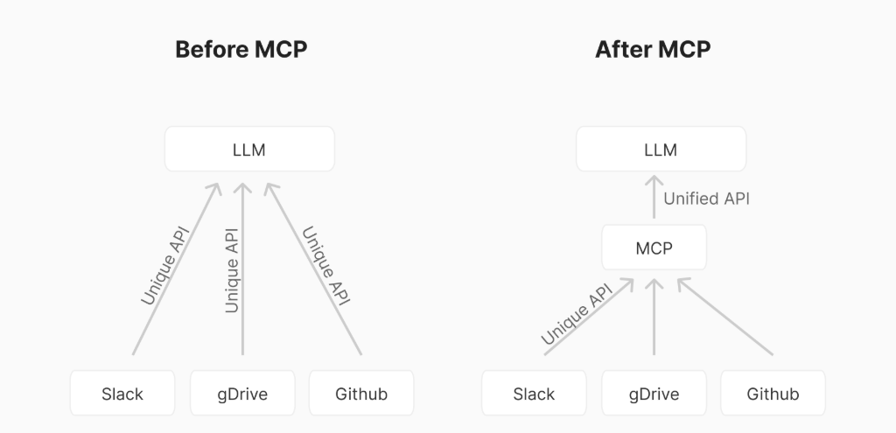
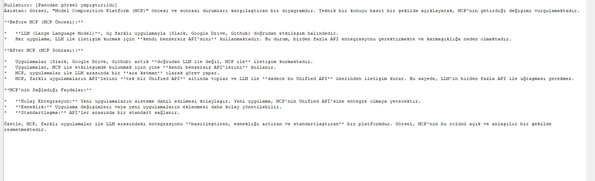

# MCP Chat Client (GUI Destekli)

Bu proje, Model Context Protocol (MCP) ile çalışan LLM tabanlı bir istemci uygulamasıdır. Uygulama, GUI üzerinden hem metin hem görsel sorgularla dış sunuculara bağlanabilir, araçları çalıştırabilir ve LLM tabanlı yanıtlar alabilir.

## Özellikler

- ✅ MCP sunucularına bağlanma
- 🖼️ Görsel analiz desteği (panodan veya dosyadan)
- 🧠 Together API üzerinden LLM entegrasyonu (LLaMA 4 modeli)
- 💬 GUI tabanlı kullanıcı arayüzü (Tkinter)
- 🧰 Sunucu tarafı MCP araç desteği (örnek: YouTube altyazı aracı)

## Deneme








## Gereksinimler

- Python 3.10+
- `.env` dosyasında `TOGETHER_API` anahtarı
- python-dotenv
- together
- youtube-transcript-api
- mcp
- Pillow
## Kurulum

```bash
pip install -r requirements.txt
```

`.env` dosyasını oluşturun:

```env
TOGETHER_API=your_together_api_key
```

## Kullanım

```bash
python main.py yt.py
```

Yukarıdaki örnekte `yt.py` bir MCP sunucusudur. Chat arayüzü açılır, ve LLM bu sunucu üzerinden YouTube transkript aracına erişebilir.

## Kısayollar (GUI içinde)

- `Ctrl+1`: Görsel sorgusu başlat (panodan)
- `Ctrl+2`: Yardım al (Kullanılabilecek araçlar)
- `Ctrl+L`: Sohbeti temizle
- `Ctrl+R`: Sohbeti sıfırla
- `Ctrl+V`: Görsel yapıştır (giriş alanında `image:` varsa)

## Sunucu Geliştirme

Yeni bir MCP sunucusu geliştirmek için:

```bash
from mcp.server.fastmcp import FastMCP

mcp = FastMCP("myserver")

@mcp.tool()
def example_tool(x: int) -> str:
    return f"Çıktı: {x * 2}"

if __name__ == "__main__":
    mcp.run(transport="stdio")
```

## Proje Yapısı

```
.
├── main.py         # Uygulama başlangıç noktası
├── d1.py           # MCP istemci mantığı (Together + MCP protokolü)
├── gui.py          # Tkinter arayüz
├── yt.py           # Örnek MCP sunucusu (YouTube transkript)
├── .env            # API anahtarı için ortam değişkenleri
└── .gitignore      # Geçici ve özel dosyalar
```

## Destek

MCP protokolü hakkında daha fazla bilgi: [modelcontextprotocol.dev](https://modelcontextprotocol.dev)

Together API hakkında bilgi: [together.ai](https://together.ai)
